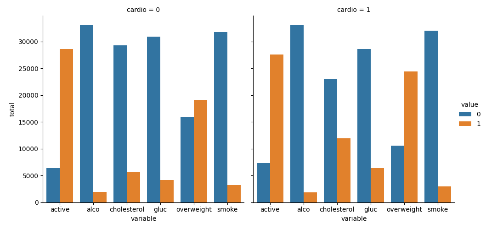
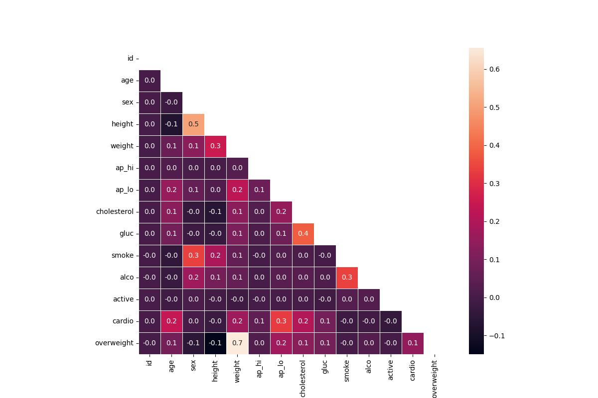

# Medical Data Visualizer

This project is part of the **freeCodeCamp Data Analysis with Python Certification**.

The goal of this project is to analyze medical examination data and visualize relationships between cardiovascular disease, body measurements, blood markers, and lifestyle factors.

---

## Project Overview

The dataset contains information collected during medical examinations. Each row represents a patient and includes measurements such as:

- Age
- Height
- Weight
- Blood pressure
- Cholesterol level
- Glucose level
- Lifestyle factors (smoking, alcohol, physical activity)
- Presence of cardiovascular disease

Using **Python, Pandas, Matplotlib, and Seaborn**, we perform data cleaning, transformation, and visualization.

---

## Features Implemented

### 1. BMI Calculation
Body Mass Index (BMI) is calculated to determine if a patient is overweight.

BMI Formula:

BMI = weight (kg) / height² (m²)

Patients with BMI > 25 are marked as overweight.

---

### 2. Data Normalization
The dataset is normalized so that:

- **0 = Good condition**
- **1 = Bad condition**

For:
- Cholesterol
- Glucose

---

### 3. Categorical Plot

A categorical plot is generated showing counts of:

- Cholesterol
- Glucose
- Smoking
- Alcohol intake
- Physical activity
- Overweight status

These are separated by patients with and without cardiovascular disease.

Libraries used:

- Seaborn
- Matplotlib

---

### 4. Heatmap Visualization

A correlation heatmap is created to show relationships between different health indicators.

Before plotting, the data is cleaned by removing incorrect records:

- Diastolic pressure higher than systolic
- Extreme height values
- Extreme weight values

The heatmap visualizes correlation between all medical variables.

---

## Technologies Used

- Python
- Pandas
- NumPy
- Matplotlib
- Seaborn

---

## Project Structure

```
medical-data-visualizer
│
├── medical_data_visualizer.py
├── medical_examination.csv
├── main.py
└── README.md
```

---

## How to Run the Project

Install dependencies:

```
pip install pandas matplotlib seaborn numpy
```

Run the program:

```
python main.py
```

---

## Dataset Source

The dataset used in this project comes from medical examination records used in the freeCodeCamp curriculum.

---

## Project Visualizations

### Categorical Plot

This chart shows the counts of lifestyle and health indicators grouped by cardiovascular disease presence.



---

### Correlation Heatmap

This heatmap shows the correlation between medical variables such as blood pressure, cholesterol, glucose, and lifestyle habits.



## Author

GitHub:  
https://github.com/Tamilarasan-K28

This project was completed as part of the **freeCodeCamp Data Analysis with Python Certification**.